====================================
Motor Tuning with EL7342 - Procedure
====================================

.. image:: img/ipag_logo.png
    :width: 400
    :align: center

Introduction
============
This document is a step by step procedure to tune your motor with the EL7342 module. It will cover the whole process, from the configuration of the NC task and the EL7342 parameters, to the tuning of both the velocity and position control loop.

To have a better understanding of what we are going to do, let's look at the control loops we will be tuning.

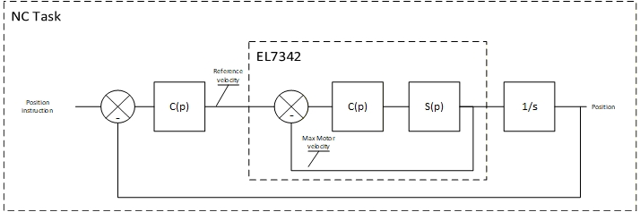

    Control loops of the motor with the EL7342 module

We have two control loops to tune: the velocity control loop and the position control loop. We have made the choice to use the EL7342 module to manage the velocity control loop. It takes the velocity command from the NC task. The position control loop is managed by the NC task. It takes the position command from the user.
We don't use the NC task to manage the velocity of the motor because the EL7342 has a much faster cycle time than the NC task, which is too slow to manage the velocity control loop efficiently.
 
The tricky part of this control loop is the interaction between the NC task and the EL7342. The NC task is sending velocity commands to the EL7342 using a 16bits signed integer. This means that the NC task and the EL7342 need to have the same velocity reference for the FSR (Full Scale Range) of this integer. 
The thing is that they aren't using the same unit in their configuration. The NC task is using mm/s while the EL7342 is using RPM but you need to have the exact value of the FSR in both configurations to have a correct behavior of your motor.

It is also important to select a value for the FSR that is higher than the maximum velocity you want to reach with your motor, otherwise the motor won't be able to correct its velocity efficiently. It is also important to not set it too high to have a good resolution on the velocity command. 
The spreadsheet provided in this document set it to 125% of the maximum velocity of the motor, which is a good value for the FSR.

Configuration
=============

-------------
NC task links
-------------

With a new TwinCAT project created and your EL7342 module scanned, the first step before starting the tuning procedure is to link your NC task to your EL7342 module. 
To do so go in the axis of your NC task, in settings, click on the Link To I/O and select your EL7342 terminal.

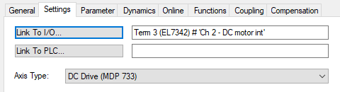
    
    Linking the NC task axis to the EL7342 terminal

Now we need to link our limit switch inputs to secure the motor and avoid any damage during the tuning procedure. 
Go in the inputs of your axis, in *FromPLC > ControlDword* and link the two FeedEnable inputs to your limit switch inputs. 

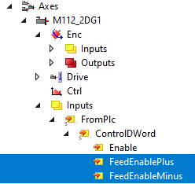
    
    Linking the limit switch

Don't forget to push your configuration to the PLC with the |activate| button.

.. |activate| image:: img/activate_button.png

-------
NC Task
-------

Now we will need to configure our NC Task. 
This part is not really about tuning, but it is necessary to have a correct configuration before starting the tuning procedure. 

Use the following spreadsheet to have the correct parameters for your motor and the correct configuration of the EL7342. It will also be useful to have the correct units for the tuning parameters of the EL7342, which can be a bit tricky to understand without it.

`Motor Tuning with EL7342 - Google Sheets  <https://docs.google.com/spreadsheets/d/1AWgOfwWHZM1icJWqUJhcqb1S85XH-hp5tlnLiJ5IdK0/edit#gid=2072590852>`_ 

For this part you will need the first sheet of the document (NC Configuration).
In the NC Configuration sheet, enter your motor's characteristics in the first table. 

Then just take the calculated values and copy them in the NC task of your project.

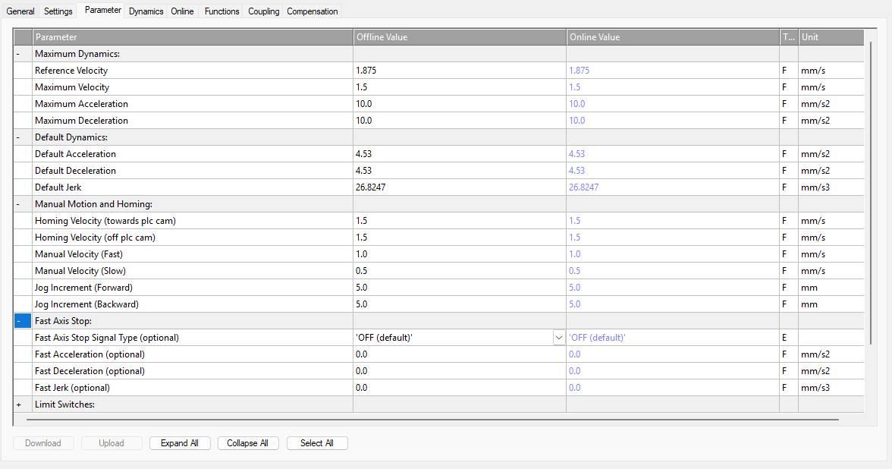

   NC task axis parameters to set for the tuning procedure

---------------
EL7342 terminal
---------------

Now to configure the EL7342 terminal use the second sheet of the document (EL7342 Configuration).

The values should be already calculated for you, you just need to copy them in the CoE Online of your EL7342 terminal.

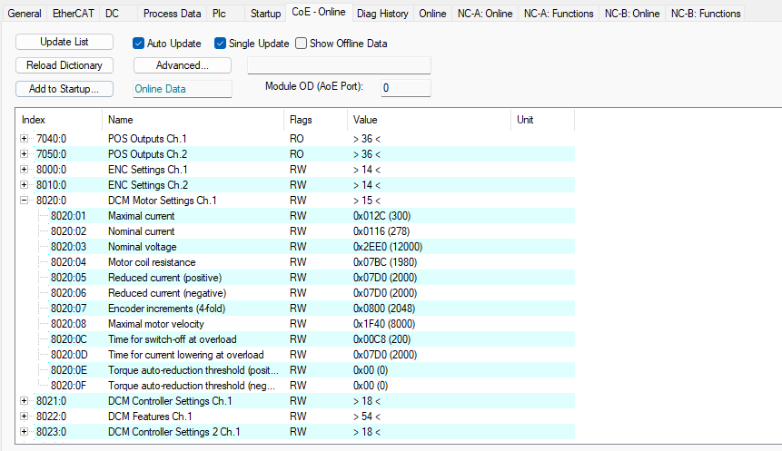

   CoE Online configuration of the EL7342 terminal

To have information on the voltage and current in the motor coils during the tuning procedure, you can go to the Process Data tab of your EL7342 terminal and change the default PDO assignment to the one with the info data.

.. figure:: img/mode_config.png
   :width: 600
   :align: center

   Change the PDO assignment to have the info data and be able to display the current and voltage of the motor on the YT chart

To have these variables appear in your YT chart, you will need to go in the image configuration of your etherCAT devices and in the ADS tab check "Enable ADS server" and "Create symbols".

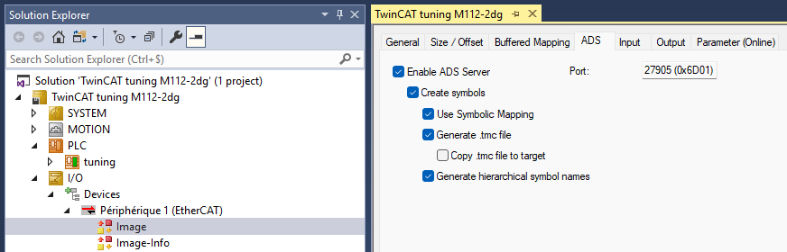

   Enable ADS server and Create symbols in the image configuration of your EtherCAT devices to have access to the EL7342 variables in the YT chart project

-----------------
Create a YT chart
-----------------
To visualize the changes in motor's velocity and position during the tuning procedure, we will be using an YT chart.
To create a YT chart, open a new TwinCAT project and select the measurement wizard.

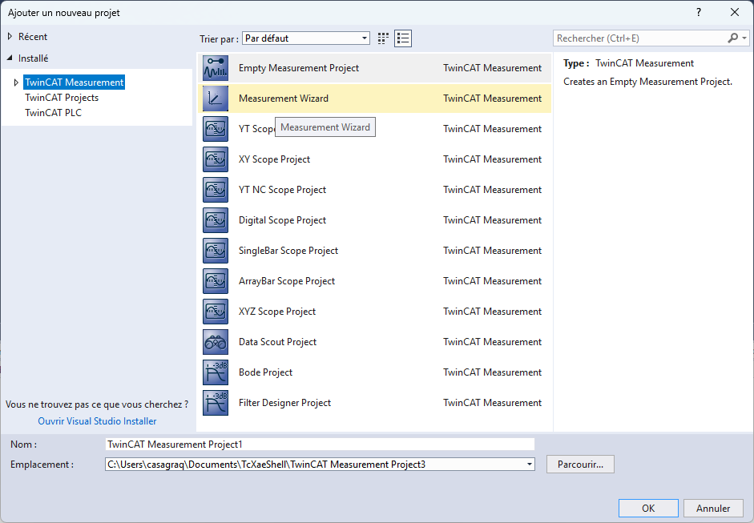

   Creating a YT chart project

Then choose a YT chart and for the data select your PLC and the NC task of your project.

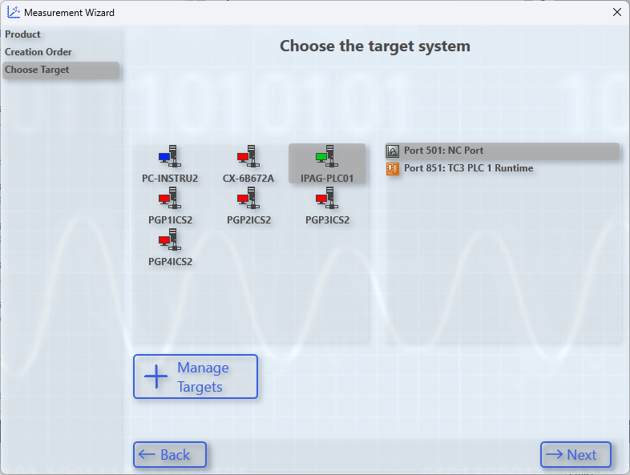

   Selecting the NC task as data source for the YT chart project

Now you can take the variables that are interesting to you :

- Actual Velocity
- Set Velocity
- Actual Position
- Set Position 
- Position Error (or PosDiff)

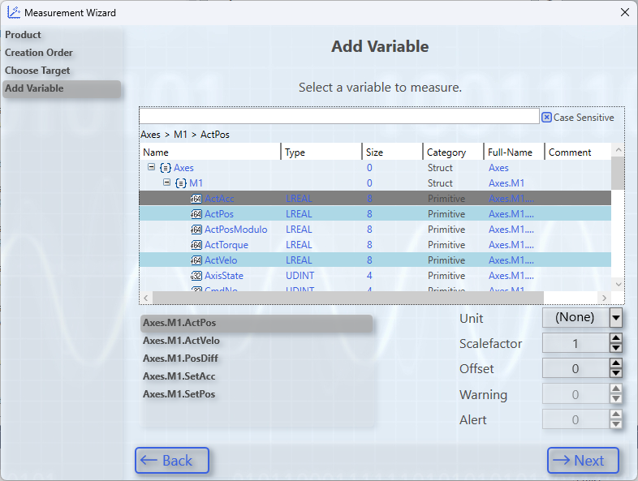

   Adding variables to the data pool of the YT chart project

Once it's done, click on the add more button.

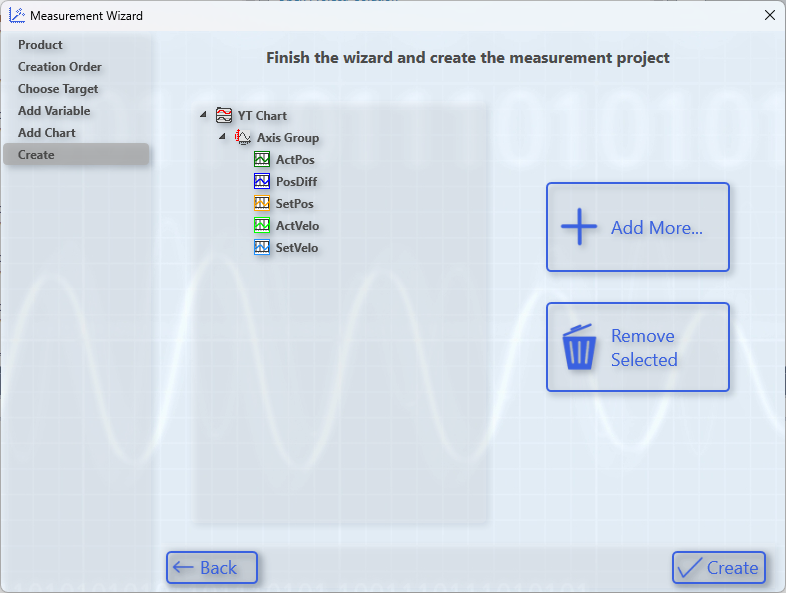

   Adding more variables to the YT chart project

Select device image to see the variables of the EL7342 terminal and select the voltage and current variables.

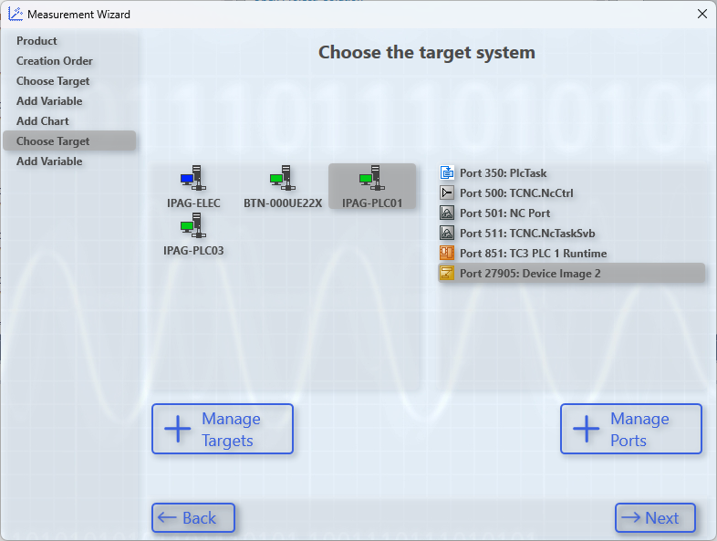

   Select device image to have access to the EL7342 terminal variables

Now you can add the voltage and current variables to your data pool and validate the creation of your YT chart project.

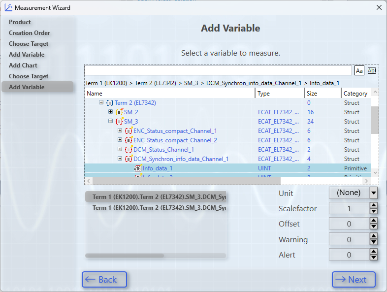

   Adding the voltage and current variables to the YT chart project

You can display the velocity, position, and position error on three different axes to have a better view of the motor's behavior during the tuning procedure.

Control loop tuning
===================

--------------------
Velocity loop Tuning
--------------------

With the motor configuration and the YT chart set, we can now focus on the tuning part of the procedure.

The Velocity Control Loop will be managed by the EL7342, the input velocity is managed by the NC. We will first focus on the EL7342 tuning.

.. important:: 

   REMINDER :  The tuning can be affected by the cycle time associated with the NC. It is recommended to set this task to 1 ms before any tuning, for better results and fewer oscillations.  Go to the "Motor and software configuration" chapter II part 1 to set the correct cycle time.

To have our EL7342 working as a velocity control loop, we have to set up some parameters in the CoE Online. Left click on your Terminal EL7342.

In the CoE Online window, look for the Operation mode located in either 8022:01 register if you are using Channel 1, or 8032:01 if you are using Channel 2. Set the mode to Automatic. In this mode, the EL7342 will automatically be set to the Velocity Control Compact with info data that has been set in the process data.
Activate the new configuration with |activate| button.

.. figure:: img/pdo_assign.png
   :width: 600
   :align: center    
   
   Operation Mode shall be automatic (will follow the PDO assignment)  

To tune our motor, we will be using the Ziegler-Nichols method. In the CoE Online, at the register 8023:0 or 8033:0 depending on the channel used, you will find the Kp, Ki and Kd factor of the velocity control loop. Respectively, 8023:01 8023:02 and 8023:08 (or 8033:01 8033:02 and 8033:08 if channel 2 is used).

.. image:: img/dcm_8023.png
   :width: 600
   :align: center
   

**Start by setting both Ki and Kd to 0.**

The Ziegler-Nichols method's first step is to find the Kp gain where the system start oscillating. This particular gain is called Ku to find it 
increase the Kp factor, **to update the changes, activate the "Auto Update" option or just "update list" in the CoE Online tab.**

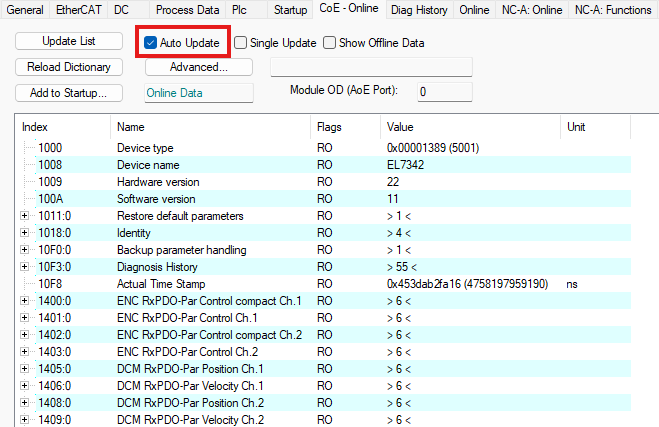

    Active the "Auto Update" option in order to automatically update changes in CoE Online assignment.

Once the changes are updated, go to the NC-online panel and click on the set button in the enabling part. Then in the pop-up window activate the controller and validate:

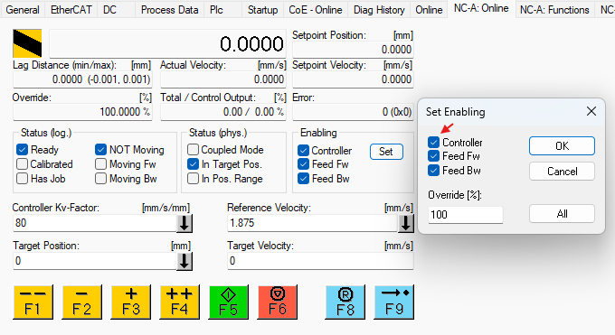

    Activate the controller in the NC-online panel

Now you can go to the Nc-function panel:

Use the Velo Step Sequence function to send velocity commands to the motor. **This function is the only way to send a Velocity command directly to the module velocity control loop.  Other functions go through the position control loop of the NC and thus will change the ultimate Kp gain.**

This function will ask the motor to go to a positive velocity, then to a negative velocity, and repeat this sequence a certain number of times. 
This will make the motor oscillate around the position it is at when you start the sequence, and thus allow you to find the ultimate gain Ku by increasing the Kp gain until the motor starts oscillating.

.. figure:: img/function_pan.png
    :width: 600
    :align: center
    
    The Velo step Sequence is necessary to bypass the NC position control loop   

Use the YT chart to visualize your motor's behavior. Here, we will be looking at the velocity of the motor so you don't need to display the position on the YT chart for now.

.. _scope_vel:
.. figure:: img/scope1.png
    :width: 700
    :align: center

    *Actual Velocity* (blue) and *Set Velocity* (green) in mm/s of an oscillating motor M112-2DG1 on an YT Chart on a Velo Step Sequence function

In our example, the motor started being unstable at Kp = 1200. Our gain Kp ultimate (Ku) is 1200.
Using the YT Chart, zoom in on the oscillations to measure the oscillation frequency.

Reminder: Use the zoom tool to zoom in on the oscillations and click it once to do an automatic Y zoom in!

.. figure:: img/scope2.png
   :width: 700
   :align: center

   Zoomed in *Actual Velocity* (blue) and *Set Velocity* (green) in mm/s of an oscillating motor M112-2DG1 on an YT Chart on a Velo Step Sequence function

.. tip::
   
    You can click on the tip of two oscillations to read the time t!

In our example, the period time Tu of the oscillations is 18 ms.

With both our Ku and Tu known, we can calculate the optimal parameters for our controller.
Using the same spreadsheet as previously, we can enter our two Ku and Tu values to automatically obtain our correctors gain.
It is not mandatory to use PID controller. You can choose to use a PD, PI, or P controller. For example, on a M111-1DG, the PID controller is not efficient and a PD controller is enough to have good behavior of the motor.

You can change the type of controller you want to use in the spreadsheet and see which gives you the best response.

`Motor Tuning with EL7342 - Google Sheets  <https://docs.google.com/spreadsheets/d/1AWgOfwWHZM1icJWqUJhcqb1S85XH-hp5tlnLiJ5IdK0/edit#gid=2072590852>`_ 

.. important:: 

     It seems that the control loop of the EL7342 is slightly more complicated than a pure P, PI, or PID. For instance, with a Ki set to zero (no integrator), the transfer function is not the one expected for a pure proportional:  the static error is compensated in some ways. However, with an integrator and derivative (PI, & PID), the transfer function is very similar to its theoretical counterpart

.. figure:: img/spreadsheet1.png
    :width: 700
    :align: center
    
    Spreadsheet screenshot
    
In our example, the spreadsheet calculates the values above. We will choose to use a PID controller. (The EL7342's PI controller is not a perfect PI and seems to compensate for things around.)
The Ziegler-Nichols method gives us the following configuration on our velocity control loop :

.. figure:: img/dcm_8023_2.png
    :width: 400
    :align: center
    
    EL7342 Control parameters for this exmemple 

And the final tuning results give the following behavior:

.. figure:: img/result_tuning.png
    :width: 700
    :align: center
    
    *Actual Velocity* (blue) and *Set Velocity* (red) (mm/s) of a correctly tuned motor M112-2DG1 on an YT Chart on a Velo Step Sequence function

Improving tuning
----------------

It is possible to have quite bad tuning easily if the ultimate gain Ku was taken too low or too high. You might encounter oscillating behavior or slow answers.
This part focuses on the common behaviors that you can encounter and how to improve them.

A. Small Oscillations 
~~~~~~~~~~~~~~~~~~~~~

.. figure:: img/small_scillations.png
   :width: 700
   :align: center

   Actual Velocity (blue) and Set Velocity (red) (mm/s) of a badly tuned motor M112-2DG1 on an YT Chart on a Velo Step Sequence function

**Symptoms :** 

- Oscillations on the whole answer
- High overshoot (>5%)

**Fix:** 

- Decrease the ultimate gain Ku and update the new factors

B. Slow Answer 
~~~~~~~~~~~~~~

.. figure:: img/slow_answer.png
   :width: 700
   :align: center
   
   Actual Velocity (blue) and Set Velocity (red) (mm/s) of a badly tuned motor M112-2DG1 on an YT Chart on a Velo Step Sequence function

**Symptoms :** 

- Low overshoot
- Velocity command reached slowly and lately

**Fix:**

- Increase the ultimate gain Ku and update the new factors

Saving configuration parameters
-------------------------------

Once you've finished tuning your motor, you will need to save your configuration in order to be able to replace your module EL7342 without losing your configuration.

.. figure:: img/startup_parameters.png
   :width: 700
   :align: center

   Parameters saved in the startup configuration 

In your Terminal EL7342, there is a Startup window that allows you to automatically configure the registers you want at the start of the project.
By clicking "New", you can add registers that will be configured every time you launch your project into the PLC.

.. figure:: img/startup_param_edit.png
   :width: 700
   :align: center

   Panel to edit startup parameters 

From here, it works as the CoE Online register configuration method previously used. Configure your **DCM Motor Settings** using the **EL7342 Configuration** page of the spreadsheet and apply the same controller factors to the **DCM Controller Settings 2**. Do not forget to **set the Operation Mode in the DCM Features register to Automatic!**

.. figure:: img/startup_param_save.png
   :width: 700
   :align: center

To save a parameter, select the register, enter its value and click OK. You will need to repeat this process for each register.

--------------------
Position Loop Tuning
--------------------

Now that our motor's velocity is controlled and tuned by the EL7342, we can start working on the NC task and its position control loop.
The controller of the NC task is configured in the Ctrl part of our Axis.

.. figure:: img/nc_nav.png
   :align: center

Two windows will be interesting for us: The NC-Controller and the Parameter.
The goal of this position control loop is to make the positioning of the motor as accurate as possible. We give it a position command, we want it to get there as precisely as possible and as fast as possible.

**A Finding the ultimate Gain Ku**
----------------------------------

To find our ultimate gain Ku, we will use a simple Position controller P. (Don't forget to activate configuration to update the controller)

.. figure:: img/nc_control_choice_p.png
   :align: center

The method is the same as the velocity control loop tuning. Increase the proportional factor Kv of your controller until the motor becomes unstable.

.. figure:: img/p_control_param.png
   :align: center

Contrary to the EL7342, you can update the changes by selecting the factor you want to change and clicking Download while the motor is still moving.

**The definition of instability is different in this case**. We will say that our motor becomes unstable when **its actual velocity will have increasing oscillations either while moving or while standing**.

A motor is unstable with oscillations on its speed during movement:

.. figure:: img/pos_instability_1.png
   :width: 700
   :align: center
   
   Actual Velocity (blue) (mm/s), Actual Position (orange) (mm) and Position Error (violet) (µm) of an oscillating motor M112-2DG1 on an YT Chart on a Reversing Sequence function

A motor is unstable with **oscillations on its speed** during standstill:

.. figure:: img/pos_instability_2.png
   :width: 700
   :align: center

   Actual Velocity (blue) (mm/s), Actual Position (orange)  (mm) and Position Error (violet) (µm) of an oscillating motor M403-1DG on an YT Chart on a Reversing Sequence function

The goal is to find the ultimate gain Ku. Contrary to the velocity control loop, we do not need to find the oscillating period Tu, since we will only be needing a proportional gain, which doesn't depend on the oscillating period.

**B Computing tuning Parameters**
---------------------------------

With the ultimate gain Ku found, we are now able to calculate the correct parameters for our new NC controller.

Using the same spreadsheet as before, we can automatically calculate our needed parameters in the "Position Controller" page: 

`Motor Tuning with EL7342 - Google Sheets  <https://docs.google.com/spreadsheets/d/1AWgOfwWHZM1icJWqUJhcqb1S85XH-hp5tlnLiJ5IdK0/edit#gid=2072590852>`_ 

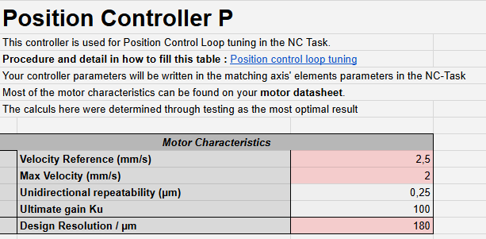

The next steps will use the YT chart Project.
Enter your motor's characteristics and apply the automatically calculated parameters to your controller. Don't forget to update the changes using the Activating Configuration button |activate|

.. figure:: img/M403_position_tuned.png
   :width: 700
   :align: center
    
   scope for a Position control loop tuned 
   
With a well tuned motor, you should now be able to see it stop precisely around the position command given.

Improving tuning
----------------

Some motors, such as small motors like the M112-2DG1 can be harder to tune correctly and get a satisfying position tuning. For that, we have multiple ways to improve our tuning depending on its current behavior.

A Tracking Improvement 
~~~~~~~~~~~~~~~~~~~~~~

It is possible that your motor is having trouble following its position while moving. This is not a huge problem and should not affect your motor's precision while at standstill, but it can be easily improved.

.. figure:: img/Position_error_while_moving.png
   :width: 700
   :align: center

   scope to illustrate a following error  

**Symptoms :** 

- High position error when moving
- Position error is far from the set dead band position deviation while moving

**Fix :**
- Increase your ultimate gain Ku and update the new factors until your position error stays around the dead band

B Oscillating Velocity 
~~~~~~~~~~~~~~~~~~~~~~

It is possible that, with a high ultimate gain Ku chosen, the values of your position controller might be too high for your motor, and its velocity can be a bit unstable. These oscillations can cause your motor to get damaged very quickly, shortening its lifespan.
As for bigger motors, finding the ultimate gain Ku can be tricky. As a reminder, the instability of your motor starts as soon as its velocity gets unstable!

.. figure:: img/Damaging_velocity_spikes.png
   :width: 700
   :align: center

   scope to illustrate unstable position control loop  

**Symptoms :**

- Velocity jolts
- Audible shaking during movement

**Fix:** 

- Decrease your ultimate gain Ku and update the new factors

Saving and Loading control loop Configuration
=============================================

Once you finished tuning and configuring your motors, it is important to save their configuration. It will also be useful if you need to use the same motors for other applications, since you already have the tuning parameters and configuration for this specific motor.

---------------------
NC Task configuration
---------------------

Saving the NC Axis configuration
--------------------------------

.. figure:: img/saving_nc.png
   :align: center

To save your motor's axis configuration, go to the NC-Task folder, right-click on your motor's axis and click on Save Axis As. It will generate a .xti file, reusable for other applications.

.. figure:: img/saving_xti.png
   :align: center

Loading an NC Axis configuration
--------------------------------

To load a saved Axis configuration, it is extremely simple.

.. figure:: img/loading_nc.png
   :align: center

Right click on the Axes folder of the NC-Task, and Add Existing Item. Select your .xti file, and your configured Axis will appear.

Make sure that the links with your I/O and PLC are still here (if you have links).

.. figure:: img/loading_nc_2.png
   :align: center

Make sure to have the NC-Task cycle time reduced to its minimum value

--------------------
EL7342 configuration
--------------------

Saving the EL7342 CoE Online configuration
------------------------------------------

We saw previously how to save in the Startup window of the EL7342 the CoE Online. Here, we will be saving these parameters like we did for the NC-task's Axis.

Right click on the Terminal EL7342, and "save Term EL7342 As".

.. figure:: img/saving_module.png
   :align: center

This will generate a .xti file, reusable like the Axis .xti file.

Loading a Terminal EL7342 configuration
---------------------------------------

To load the Terminal EL7342 configuration saved, we will need to have our devices scanned and present in our I/O folder.

Right-click on the Terminal you want to load in the configuration, and insert an existing item to add another Terminal EL7342.

.. figure:: img/load_module_1.png 
   :align: center

You may need to remove the original Terminal EL7342.

.. figure:: img/remove_module.png
   :align: center

And now Activate the configuration |activate|.
You should now be able to use your terminal EL7342 freely with its saved data!

Characterization of the motor tuning
====================================

--------------------
Behavior reccordings
--------------------

To characterize the tuning of your motor, you can use the YT chart to visualize its behavior under certain circumstances.
To have an idea of the response of our motor to a level instruction on the velocity, we can use the Velo Step Sequence function.

Send three to four velocity step sequences of 4 cycles with a velocity starting from the nominal velocity of your motor and divide it by ten for each sequence. 

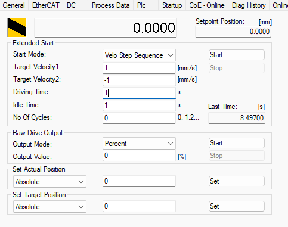

   Velo Step Sequence function configuration

This will give you a good idea of the response time of your motor, its overshoot and its behavior at low velocity.

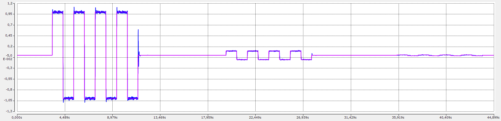

For the position precision characterization, you can use the online panel. You can manually send a sequence with a target position positive, then 0, and a target position negative. Alike the velocity step sequence, you can repeat this sequence with different position values, starting from a position far from the homing position and divide it by ten for each sequence.

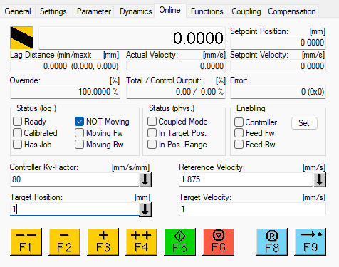

   Reversing Sequence function configuration

.. important:: 

   TIP :  To control the motor manually with the online panel, it is important to set the override to 100% to be able to move the motor

This will give you a good idea of the precision of your motor and its behavior while moving to a position and while standing.

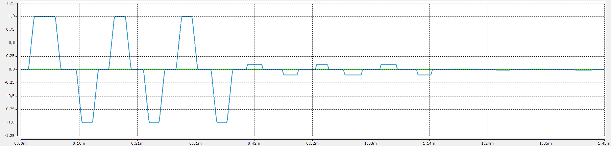

If you want to see if the tracking of your motor is good you can send it to a position at a really slow velocity and see if it is able to follow the position command without a big error.

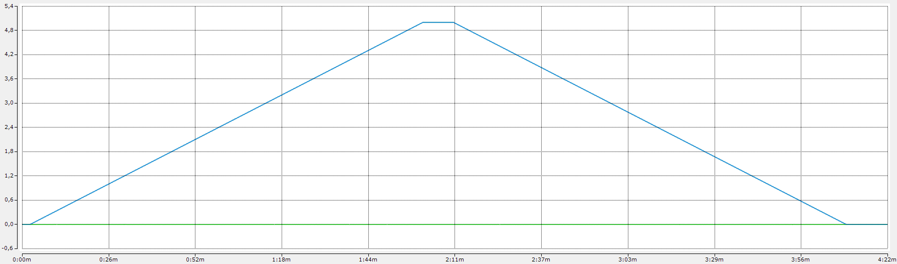

---------------------
Precision test script
---------------------

If you want to have a more precise and semi-automated characterization of your motor's precision, you can use the script in the following link. It will send a sequence of position commands to the motor and save the actual position reached for each command in a .csv file that you can then use to analyze the precision of your motor.

`Precison test script Github repository  <https://docs.google.com/spreadsheets/d/1AWgOfwWHZM1icJWqUJhcqb1S85XH-hp5tlnLiJ5IdK0/edit#gid=2072590852>`_

Archive work
============

-------------------
Configuration files
-------------------

M112-2DG1:
----------
`M112-2DG1 Configuration files  <https://fr.wikipedia.org/wiki/Erreur_HTTP_404>`_

M111-1DG:
---------
`M111-1DG Configuration files  <https://fr.wikipedia.org/wiki/Erreur_HTTP_404>`_

-------------------
Behavior recordings
-------------------